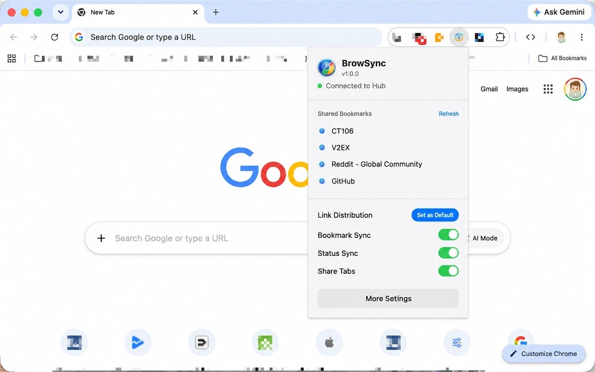

# BrowSync

[English] | [简体中文](README_zh.md)

**BrowSync** is a cross-browser routing and sync hub for macOS. It unites Safari, all Chromium-based browsers, and Firefox, intelligently routing links and syncing bookmarks and sessions in real-time.

<a href="https://apps.apple.com/cn/app/id6784604835?mt=12"></a> <a href="https://chrome.google.com/webstore/detail/nahmlhblgjnkkcmaiicngaepeepofpkh"></a> <a href="https://addons.mozilla.org/en-US/firefox/addon/brow-sync/"></a>


> [!IMPORTANT]
> **Local Execution**
> BrowSync's synchronization and URL routing happen locally on your device via a WebSocket daemon. Browsing data (bookmarks, cookies, local storage, active tabs) is stored on your machine without external server involvement.

## 🚀 Features

- **URL Routing**: Register BrowSync as the default macOS browser to direct links to specific browsers based on domain, URL patterns, query strings, source application, or time of day.
- **Bookmark Sync**: Sync bookmarks in real-time across Safari, all Chromium-based browsers, and Firefox.
- **State Sync**: Sync Cookies, LocalStorage, and sessionStorage across supported browsers to maintain login states.
- **Tab Sharing**: View active tabs across browsers. It filters out incognito tabs and non-HTTP(S) local pages, and deduplicates URLs.
- **Sync Strategies**: Supports unidirectional (master-slave), last-write-wins (based on access time), and bidirectional merging.
- **Site Control**: Manage sync scope with whitelist/blacklist rules and per-site policies.
- **Local Network**: Communication is handled locally via a WebSocket daemon (`ws://127.0.0.1:62333`). No external servers are used.
- **Native macOS App**: Built with SwiftUI. Supports Dark/Light themes, Menu Bar integration, and Launch at Login.
- **iCloud Sync**: Automatically sync your routing rules, settings, and site preferences across all your Mac devices via iCloud.

## 🌐 Supported Browsers

BrowSync supports a wide range of browsers out of the box, and allows you to add virtually any Chromium-based browser manually.

**Natively Supported:**
- Safari
- Google Chrome
- Arc
- Microsoft Edge
- Brave
- Firefox
- Vivaldi
- Opera
- Yandex Browser
- Orion
- Helium
- BrowserOS

**Custom Browsers:**
If your favorite Chromium-based browser is not on the list, you can easily add it! Simply go to the "Browsers" tab in the app, click **"Add Custom Browser..."**, and select your browser's `.app` file from the Applications folder.

## 📸 Screenshots

| | |
|:---:|:---:|
|  |  |
|  |  |
|  |  |
|  |  |

## 🛠 Installation & Setup

### 1. Requirements

| Tool | Version |
|------|---------|
| macOS | 14.0+ |
| Xcode | 15.0+ |
| Swift | 5.10+ |
| Homebrew | Latest |
| XcodeGen | 2.40+ |

### 2. App Store

You can download BrowSync from the Mac App Store:
[Download on the App Store](https://apps.apple.com/cn/app/id6784604835?mt=12)


### 3. Build from Source

```bash
# 1. Clone the repo
git clone https://github.com/chentao1006/browsync.git
cd browsync

# 2. Generate Xcode project using XcodeGen
xcodegen generate

# 3. Open the generated project
open BrowSync.xcodeproj
```

Then in Xcode:
1. Select the **BrowSync** target → **Signing & Capabilities**
2. Set your **Development Team**
3. Press **⌘R** to build and run

### 4. Install Browser Extension

**Chromium-based Browsers**:
You can install the BrowSync extension directly from the Chrome Web Store:
[Install from Chrome Web Store](https://chrome.google.com/webstore/detail/nahmlhblgjnkkcmaiicngaepeepofpkh)

**Firefox**:
You can install the BrowSync extension directly from Firefox Add-ons:
[Install from Firefox Add-ons](https://addons.mozilla.org/en-US/firefox/addon/brow-sync/)

**Safari**:
The app includes a native Safari extension. After running the BrowSync app, you can enable it directly in Safari's Settings -> Extensions.

## 🔍 Architecture & Protocol

### System Architecture

```text
Safari Ext        Chromium Ext        Firefox Ext
      │                  │                   │
      └──────────────────┼───────────────────┘
                         │
                  BrowSync Daemon
              ws://127.0.0.1:62333
                         │
                   BrowSync App
              (macOS native, SwiftUI)
```

### Directory Structure

```text
BrowSync/
├── BrowSync/                   # macOS App (Swift/SwiftUI)
│   ├── App/                    # Entry point, AppState
│   ├── Views/                  # Multi-tab UI (Browsers, Rules, Sync)
│   ├── Core/                   # DaemonServer, BrowserScanner, BrowserLauncher
│   ├── Models/                 # Data models (Browser, Rule, SyncModels, WSMessage)
│   ├── Services/               # RulesEngine, SyncService, SettingsService
│   └── Resources/              # Info.plist, Localizable.strings (en + zh-Hans)
│
├── SafariExtension/            # Safari Web Extension target
│   ├── SafariWebExtensionHandler.swift
│   └── Resources/
│       ├── manifest.json
│       ├── background.js       # WebSocket client, bookmark/cookie/tab sharing
│       ├── content.js          # localStorage/sessionStorage proxy
│       ├── popup.html
│       └── popup.js
│
├── ChromiumExtension/          # Shared MV3 extension (Chromium-based)
│   ├── manifest.json
│   ├── background/
│   │   └── service-worker.js   # Same logic as Safari background.js
│   ├── content/
│   │   └── content-script.js
│   ├── popup/
│   │   ├── popup.html
│   │   └── popup.js
│   └── _locales/
│       ├── en/messages.json
│       └── zh_CN/messages.json
│
├── FirefoxExtension/           # MV3 extension for Firefox
│   ├── manifest.json           # Includes Firefox-specific CSP and settings
│   └── (Same structure as ChromiumExtension)
│
├── project.yml                 # XcodeGen configuration
├── BrowSync.entitlements       # App entitlements (Sandbox: NO)
├── package.sh                  # Script to package the app
├── release.sh                  # Script to automate releases
├── test.sh                     # Script to run tests
├── index.html                  # Landing page
└── privacy.html                # Privacy policy
```

### WebSocket Protocol

All browser extensions connect to the BrowSync daemon at `ws://127.0.0.1:62333`.

- **Registration**: `{ "type": "register", "browser": "chrome", "instanceId": "chrome-main" }`
- **Heartbeat (every 30s)**: `{ "type": "heartbeat" }`
- **Sync**: 
```json
{
  "type": "sync",
  "browser": "safari",
  "site": "chatgpt.com",
  "category": "bookmarks",
  "payload": { "kind": "bookmarks", "bookmarks": [...] },
  "messageId": "uuid",
  "timestamp": 1234567890
}
```

## 📁 Data Directory & Identifiers

BrowSync stores its data locally in your Application Support folder:

```text
~/Library/Application Support/BrowSync/
├── sites/          # Per-site sync state
├── bookmarks/      # Synced bookmark snapshots
├── logs/           # sync-YYYY-MM-DD.log
└── settings.json   # All app settings
```

**Bundle IDs:**
- App: `com.ct106.browsync`
- Safari Extension: `com.ct106.browsync.extension`
- App Group: `group.com.ct106.browsync`

## 🎯 Feature Status (MVP)

| Feature | Status |
|---------|--------|
| Browser detection & extension status | ✅ |
| WebSocket Daemon | ✅ |
| URL routing rules & Default browser handling | ✅ |
| Bookmark real-time sync | ✅ |
| localStorage & sessionStorage cross-browser sync | ✅ |
| Cookie cross-browser sync | ✅ |
| Real-time Tab Sharing (w/ deduplication & privacy filter) | ✅ |
| Granular site sync control | ✅ |
| Safari, Chromium & Firefox MV3 Extensions | ✅ |
| Dark/Light/System theme & EN/zh-Hans localization | ✅ |
| iCloud Sync for rules and settings | ✅ |

## ⚠️ Important Notes

- **Default Browser**: To utilize the URL routing feature, BrowSync must be set as your default system browser in macOS Settings.

## 🛡 License

This project is licensed under the MIT License. See [LICENSE](LICENSE).
